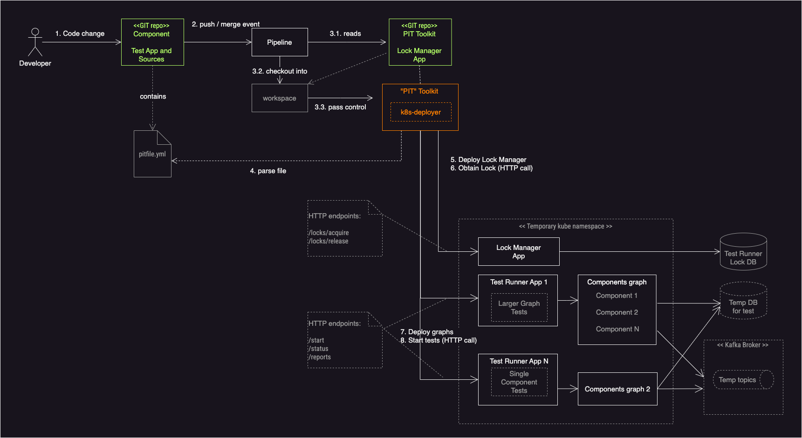

# Tools for deploying and executing Performance and Integration Tests

## PIT Concept

The process starts when GIT event, such as merge or push, is picked up by project pipeline. This may be coded as Jenkins pipeline or as GitHub Actions workflow.

It is expected that pipeline will checkout PIT project from well-known location or alternatively, tools provided by PIT Toolkit may be pre-installed into pipeline image.

PIT will locate specification file `pitfile.yml` in the repository which triggered the pipeline.

PIT will examine the content of git event and pass it through `filters` as they are defined in the pit spec file. Filter is defined as an array of regex patterns to be applied to file names which were part of the GIT event. If some filter matches a file, then PIT will start execution of deployment process (The process is visualised in the diagram below).

The PIT spec file contains definitions of:
- Lock Manager app
- The list of test suites

PIT Toolkit has a built-in capability of deploying components into K8s namespace.

1. PIT deploys Lock Manager app.
2. PIT iterates over test suites and deploys required dependencies into K8s namespace (the graph).
3. One of graph entries is known as Test Runner App. Test Runner App is an application capable of running performance or integration tests against multiple components. To start tests PIT sends HTTP request to Test Runner Application, for example `POST /start`.

At this point we have:
- Lock Manager app is deployed in the namespace.
- The set of locks obtained by PIT.
- Graph of components deployed in the namespace.
- Test Runner App is deployed in the namespace and executing tests.

Upon deployment, Lock Manager will prepare its database. It is expected that permanent database server prepared upfront and is accessible from the namespace. This DB is permanent it survives the lifespan of temporary namespace where Lock Manager is running. The DB is used to implement exclusivity over the running tests. Multiple instances of Lock Manager may be present in the K8s cluster each sitting in its own temporary namespace. With the help of locking only one test suite will ever run at the same time unless there is no dependency between tests.

There could be multiple Test Runner Apps deployed in the namespace. These apps may be designed to test different graphs. In such setup the invocation of these multiple Test Runner apps is orchestrated by PIT and subject to locking strategy.

All tests are divided into test suites and defined in the relevant section of pitfile. Pitfile may contain a mixed definition of local and remote test suites.

_Local_ test suites are defined in the same repository as pitfile.
_Remote_ test suites are defined as reference to remote pitfile. In this case PIT will download the file from remote repository and use its "testSuites" section.


Once Test Runner App finishes executing the test report is available via dedicated endpoint, for example via `GET /reports/{$execution_id}`

Test reports are stored permanently. Multiple reports which are obtained from different Test Runner Apps but produced in the same test session may be stitched together before storing.

The responsibilities of all mentioned components are defined as:


**Pipeline**

- Checks out PIT app and launches it

**PIT Toolkit**

- Parses `pitfile.yml`
- Executes main PIT logic described above
- Creates K8s namepsace
- Deploys Lock Manager
- Deploys Test Runner App
- Deploys graph
- Collects test report and stores it permanently
- Cleans up namespace

**Lock Manager**

- Exposes HTTP API for locks management

**Test Runner App**

- Accepts "start" signal to begin test execution
- Runs tests
- Exposes test report via HTTP

**The YAML specification (pitfile)**

- Controls whether PIT should run at all based on optional filters
- Encapsulates the location of graph within each test suite
- Defines what to do with test report




## Example of specification YAML

```YAML
projectName: Talos Certifier
version: "1.0"

trigger:
  description: Runs only if Rust source code changed in packages impacting Talos Certifier
  name: Detect Talos Certifier changes
  filter:
    expressions:
      - "packages/talos_certifier/.*"
      - "packages/talos_suffix/.*"
      - "packages/talos_certifier_adapters/.*"
      - "packages/talos_common_utils/.*"
      - "packages/talos_rdkafka_utils/.*"
      - "packages/cohort_sdk/.*"

# - - - - - - - - - - - - - - - - - - - - - - - - - - - - - - - - - - - -
# - Lock-Manager is independent node app. Sources are hosted in pit-toolkit repo.
# - The new re-defined Sitrus is also node app. Sources are hosted in the same pit-toolkit repo.
# Given two points above it is enough to have a single fetch step for obtaining Lock Manager and "new Sitrus"
# When it comes to deploying Lock Manager, Sitrus need to be given a location of script
# through which to kick start the deployment. See "deploymentLauncher".
lockManager:
  description: Defines the Lock manager application
  location:
    gitRepository: git://127.0.0.1/pit-toolkit.git
    gitRef: ${{ env.PIT_TOOLKIT_BRANCH }}
  deploymentLauncher: deployment/pit/lock-manager/deploy.sh
# - - - - - - - - - - - - - - - - - - - - - - - - - - - - - - - - - - - -

testSuites:
  # - - - - - - - - - - - - - - - - - - - - - - - - - - - - - - - - - - - -
  - name: Testset for standalone Talos Certifier
    id: testset-talos-certifier-default
    location.type: LOCAL # Optional. Defaults to 'LOCAL' - the definition is taken from this file

    lock:
      timeout: 1h
      ids: [ lock-talos-certifier ]

    trigger: # This is optional, when not defined, test will trigger when top level trigger goes off
    deployment:
      graph:
        - componentName: Talos Certifier Test App
          location:
            type: LOCAL # optional, defautls to 'LOCAL'
          deploymentLauncher: deployment/talos-certifier-test-app/pit/deploy.sh

        - componentName: Talos Certifier"
          location:
            # Lets assume that pipeline fired as a result of push into Talos Certifier project
            type: LOCAL
          deploymentLauncher: deployment/talos-certifier/pit/deploy.sh

        - componentName: Talos Replicator"
          location:
            # Lets assume Talos Certifier and Replicator (made for testing Talos Certifier) are in the same repository
            type: LOCAL
          deploymentLauncher: deployment/talos-replicator/pit/deploy.sh

        - componentName: Some Other Component"
          # This is an example how to defnie the remote component
          location:
            type: REMOTE
            gitRepository: git://127.0.0.1/some-other-component.git
            gitRef: # Optional, defaults to "refs/remotes/origin/master"            
          deploymentLauncher: deployment/pit/deploy.sh
  # - - - - - - - - - - - - - - - - - - - - - - - - - - - - - - - - - - - -
  - name: Testset for Talos Certifier integrated with Messenger
    id: testset-talos-certifier-and-messenger
    location:
      type: REMOTE
      gitRepository: git://127.0.0.1/talos-perf-tests.git
      gitRef: ${{ env.GIT_REF_TALOS_PERF_TESTS }} # Optional. Defaults to "refs/remotes/origin/master"
      pitFile: 'pitfile.yml' # Optional, defaults to "pitfile.yml" in the project root
    # This will:
    # 1) Read pitfile from specified remote repository,
    # 2) Select subsection of file from "testSuites" node where entries are matching IDs.
    #    For example, "SELECT * FROM remote/pitfile.yml#testSuites WHERE id IN(testSuiteIds)"
    # Optional, when not defined, all when defined as empty array then all tests are included.
    testSuiteIds: [ 'testset-talos-certifier-and-messenger' ]
```