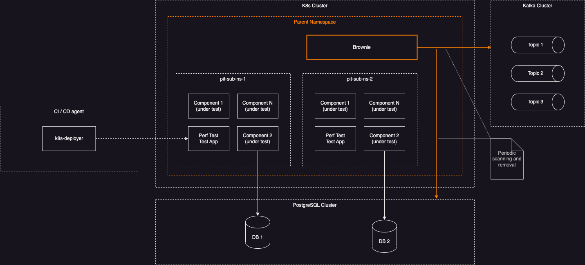

# Brownie

## Introduction

[Brownie] (https://en.wikipedia.org/wiki/Brownie_(folklore)) is a housekeeping daemon whose responsibility is to find and remove stale resources created by PIT but could not be cleaned for technical reasons (PIT test has stopped by user, or process existed unexpectedly etc.)

Brownie app is deployed into k8s cluster as periodic CronJob. It scans for resources matching a pre-determined naming pattern and removes them when they get old. Currently we support *PostgresSQL databases* and *Kafka topics*. More resource types may be added in the future.

Application needs to be configured with:
- The access to PostgreSQL and Kafka using elevated privileges.
- The regexp pattern. Brownie will use it to extract the resource creation timestamp from resource name and then use that timestamp for determining whether the resources should be removed.
- The retention period of old resources. Resources younger that the retention period will not be deleted.

## Deployment Architecture

## How it works

Brownie has two internal logical modules with similar functionality. Each module connects to a dedicated resource server and scans for all available resources. For example, one such module is for monitoring a PostgreSQL server. Brownie connects to PostgreSQL server, fetches the list of all databases using name matching query `SELECT ... FROM ... WHERE dbname LIKE %pit%` and evaluates each found database. If database name contains a predefined timestamp pattern, then Brownie will either leave it as is or drop the database. The decision is based on database age. The database should be old enough and that is determined by _retention period_. The _retention period_ is a configuration parameter.

The exaclty same logic applies to Kafka topics.

It goes without saying that we do not want to drop resources which are currently being used or which are not used now but will be used soon. The key aspect of Brownie functionality is its ability to determine the age of resource. Theoretically, the most straightforward way to find out when resource was created is to query the resource metadata. However, in practice this is not so simple and might not be possible for some resources. As scanning resource metadata is somewhat very specific to resource type and may also depend on the specific version of version of resource servers (PosgreSQL, Kafka, ElasticSearch and etc). To provide a generic and simple solution we ask that ephemeral resources, such as temporary databases, topics (and other resources which we will support in the future) **have creation timestamp built into the resource name**.

### Example

The list of resources:

| Type          | Name                                     | Creation time
|---------------|------------------------------------------|-----------------------
| PostgreSQL DB | bank_accounts_pit_ns1_ts20240501220100   | 2024 May 1 at 22:01:00 
| Kafka topic   | new_sales_order_pit_ns1_ts20240607150201 | 2024 Jun 7 at 15:02:01

With the resources named like in the example above Brownie will be able to extract their creation dates just by reading a resource name. The following regular expression can be used `^.*pit.*(ts[0-9]{14,14}).*`

## Configuration 

Brownie does not enforce any specific naming strategy for your resources other than having 14 digits timestamp embedded in its name.

| Parameter              | Env variable         | Description
|------------------------|----------------------|-------------------
| --dry-run              | DRY_RUN              | "true" or "false". When "false" resources will not be deleted
| --retention-period     | RETENTION_PERIOD     | 1day, Ndays, 1hour, Nhours, 1minute, Nminutes and etc.
| --timestamp-pattern    | TIMESTAMP_PATTERN    | The regexp pattern with the following group `(ts[0-9]{14,14})`    
| --pghost               | PGHOST               | 
| --pgport               | PGPORT               | 
| --pgdatabase           | PGDATABASE           | The database is used for initial connection only.
| --pguser               | PGUSER               |
| --pgpassword           | PGPASSWORD           |
| --kafka-brokers        | KAFKA_BROKERS        |
| --kafka-port           | KAFKA_PORT           |
| --kafka-client-id      | KAFKA_CLIENT_ID      |
| --kafka-username       | KAFKA_USERNAME       | Optional
| --kafka-password       | KAFKA_PASSWORD       | 
| --kafka-sasl-mechanism | KAFKA_SASL_MECHANISM | Optional

