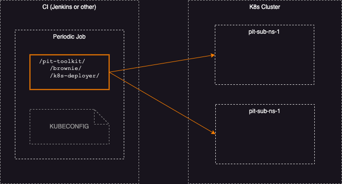

# Brownie

## Introduction

Brownie is a housekeeping daemon whose responsibility is to find and remove stale resources created by PIT but could not be cleaned for technical reasons (PIT test has stopped by user, or process exited unexpectedly etc.). About the name: https://en.wikipedia.org/wiki/Brownie_(folklore)

Brownie app is made up of two modules.
- One module is intended to run inside K8s cluster. It takes care of infrastructure resources which are external to kubernetes such as old databases and topics.
- Another module is intended to run outside of K8s cluster. It takes care of resources which are internal to kubernetes such as old namespaces and their internal objects.

The following content is split into two sections explaining the details of each of these modules.

# The Brownie App module

Brownie app is the module which is intended to run inside K8s cluster. It is deployed into k8s cluster as periodic CronJob. Job scans for resources matching a pre-determined naming pattern and removes them when they get old. Currently we support *PostgresSQL databases* and *Kafka topics*. More resource types may be added in the future.

Application needs to be configured with:
- The access to PostgreSQL and Kafka using elevated privileges.
- The regexp pattern. Brownie will use it to extract the resource creation timestamp from resource name and then use that timestamp for determining whether the resources should be removed.
- The retention period of old resources. Resources younger than the retention period will not be deleted.

The entry-point into this module is the main index file: `src/index.ts`

## Scheduler

Brownie app does not have scheduling logic. Its internal logic is designed to focus only on the cleaning functionality. The scheduling activities, such as time tracking, starting, stopping, pausing etc. are not part of Brownie app. Brownie relies on external scheduler. The good reliable scheduler is already availabe in K8s - "CronJobs" https://kubernetes.io/docs/concepts/workloads/controllers/cron-jobs/

When K8s schedules a job run it will create a fresh Brownie pod. The pod will exit once Brownie app completes its cleaning routine.

## Deployment

This module is packaged as docker image and published into Container Registry of GitHib Packages: https://docs.github.com/en/packages/learn-github-packages/introduction-to-github-packages. It should be deployed as k8s CronJob.

## Deployment Architecture

## How it works

This section explains the details of what happens inside Brownie app when pod runs.

Brownie has two internal logical modules with similar functionality. Each module connects to a dedicated resource server and scans for all available resources. For example, one such module is for monitoring a PostgreSQL server. Brownie connects to PostgreSQL server, fetches the list of all databases using name matching query `SELECT ... FROM ... WHERE dbname LIKE %pit%` and evaluates each found database. If database name contains a predefined timestamp pattern, then Brownie will either leave it as is or drop the database. The decision is based on database age. The database should be old enough and that is determined by _retention period_. The _retention period_ is a configuration parameter.

The exactly same logic applies to Kafka topics.

It goes without saying that we do not want to drop resources which are currently being used or which are not used now but will be used soon. The key aspect of Brownie functionality is its ability to determine the age of resource. Theoretically, the most straightforward way to find out when resource was created is to query the resource metadata. However, in practice this is not so simple and might not be possible for some resources. As scanning resource metadata is somewhat very specific to resource type and may also depend on the specific version of resource servers (PosgreSQL, Kafka, ElasticSearch and etc). To provide a generic and simple solution we ask that ephemeral resources, such as temporary databases, topics (and other resources which we will support in the future) **have creation timestamp built into the resource name**.

### Example

The list of resources:

| Type          | Name                                     | Creation time
|---------------|------------------------------------------|-----------------------
| PostgreSQL DB | bank_accounts_pit_ns1_ts20240501220100   | 2024 May 1 at 22:01:00
| Kafka topic   | new_sales_order_pit_ns1_ts20240607150201 | 2024 Jun 7 at 15:02:01

With the resources named like in the example above Brownie will be able to extract their creation dates just by reading a resource name. The following regular expression can be used `^.*pit.*(ts[0-9]{14,14}).*`

## Configuration

Brownie does not enforce any specific naming strategy for your resources other than having 14 digits timestamp embedded in its name.

| Parameter              | Env variable         | Description
|------------------------|----------------------|-------------------
| --dry-run              | DRY_RUN              | "true" or "false". When "true" resources will not be deleted
| --retention-period     | RETENTION_PERIOD     | 1day, Ndays, 1hour, Nhours, 1minute, Nminutes and etc.
| --timestamp-pattern    | TIMESTAMP_PATTERN    | The regexp pattern with the following group `(ts[0-9]{14,14})`
| --pghost               | PGHOST               |
| --pgport               | PGPORT               |
| --pgdatabase           | PGDATABASE           | The database is used for initial connection only.
| --pguser               | PGUSER               |
| --pgpassword           | PGPASSWORD           |
| --kafka-brokers        | KAFKA_BROKERS        |
| --kafka-port           | KAFKA_PORT           |
| --kafka-client-id      | KAFKA_CLIENT_ID      |
| --kafka-username       | KAFKA_USERNAME       | Optional
| --kafka-password       | KAFKA_PASSWORD       |
| --kafka-sasl-mechanism | KAFKA_SASL_MECHANISM | Optional

# The external job module

The external job module is intended to run outside of K8s cluster. It is made of two packages:
- the external scheduler (the launcher)
- the node application.

Please refer to the architecture diagram.

Sources for the node application package can be found under `src/k8ns/`. Hence, the entry-point is `src/k8ns/index.ts` The purpose of this package is to delete old sub-namespaces from K8s.

It requires two inputs:
- The retention period of old namespaces. Namespaces younger than the retention period will not be deleted.
- The JSON file containing the list of objects each describing a child namespace.

## Scheduler

The job scheduling is delegated to CI/CD. Any CI/CD solution like Jenkins and similar, can be used if it can invoke a shell script. It is expected that CI will periodically invoke this script: `brownie/scripts/clean-ns.sh`

## Deployment

The good news is that there is nothing to be deployed. All what is needed is to configure CI to host a periodic Job which can checkout brownie code and invoke a shell command.

## Deployment Architecture

## How it works

Scheduler will invoke a shell script which then query K8s cluster, generate a list of namespaces in JSON format and write into the file. Then script will launch a node process passing the file as parameter. This design allows us to keep node app simple and small. The code boils down to parsing the JSON, extracting old namespaces from the given list, and deleting them one by one. The deletion logic is re-used from PIT K8s-deployer. Since k8s-deployer can create and clean namespaces, we can re-use its cleaning code. Here is the implementation: `pit-toolkit/k8s-deployer/scripts/k8s-manage-namespaces.sh`

The conceptual algorithm looks like this:

1. CI job awakes and invokes `clean-ns.sh`;
2. The `clean-ns.sh` queries K8s and makes JSON file;
3. The `clean-ns.sh` launches node app;
4. The node app cleans old namespaces.

## Configuration

| Parameter              | Env variable         | Description
|------------------------|----------------------|-------------------
| --dry-run              | DRY_RUN              | "true" or "false". When "true" resources will not be deleted
| --retention-period     | RETENTION_PERIOD     | 1day, Ndays, 1hour, Nhours, 1minute, Nminutes and etc.
