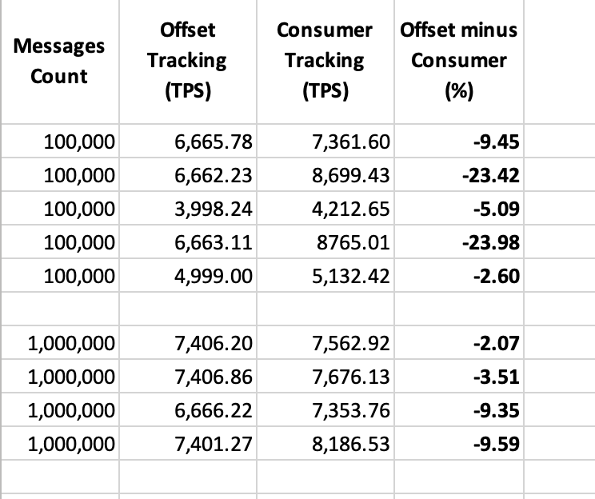

# Consumer Metrics

This example demonstrates two methods of measuring metrics of kafka consumer.

**Method 1** - consumer is responsible for measuring how quickly it consumes messages, by reading current server time at each message arrive.

**Method 2** - publisher or external process is responsible for measuring how the offset of consumer group moves forward.
This method makes the following assumptions:
  - Consumer is not auto committing offsets (or it is auto-committing offsets frequently)
  - Publisher can predict what will be the last offset
  - The topic has a single partition.

## How to run

- We need two terminal windows
- We need running kafka with (auto-create topics feature) or with pre-created topic named "local_pit_consumer_metrics"
- Kafka is listening on 127.1.1:9092 and can take plaintext connection with `scram-sha-512` and credentials: `admin/admin`.
  See `pit-toolkit/examples/consumer-metrics/src/core.ts`

In terminal one run the consumer:
```
cd pit-toolkit/examples/consumer-metrics
npm i
npm run start.consumer
```
It will connect to kafka and listen for messages from `local_pit_consumer_metrics` topic. When messages start coming it will print current consuming metrics every few seconds. When messages stop coming and keep silence for 30 seconds, the current metrics will be reset to zero. Once messages start coming again, the new metric will start printing.

In the second terminal run the producer:
```
cd pit-toolkit/examples/consumer-metrics
npm i
npm run start.publisher
```
It will start two activities concurrently:
- it will start publishing messages one by one (not in batches).
- it will connect to kafka as admin and start fetching the offset from `local_pit_consumer_metrics` topic and consumer group used by consumer from terminal one.
- once it detects that consumer's offset has moved forward to its last value, the metric will be printed and program will terminate.

## Test run results

Below is the table of metrics comparing 9 test sessions. First 5 sessions each used 100k messages. The remaining 4 sessiones used 1mln messages each. All tests and kafka were running on Macbook.



The column "Offset minus Consumer (%)" shows the discrepancy in reported metrics in per cents. In other words, it shows how much slower the Method 2 is comparing to Method 1.