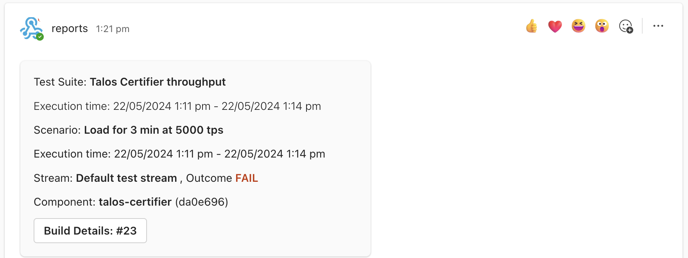

# Post Test Actions

## Introduction

The Post Test Actions (or PTA in short) is additional component designed to provide a feedback to users about the result of recently executed PIT test. PIT itself is only responsible for preapring the environment for tests, running them, obtaining test reports, and permanently storing these reports. PTA extends this functionality by notifying the end user about the outcome of testing session.

PTA app is aware of the structure of test report (see [report schema](src/report/schema-v1.ts)). Application takes two major inputs:
- the location of PIT reports and
- the list of actions which need to be executed.

PTA find the report, reads it, and executes the appropriate action based on the report outcome and given configuration.

## Actions Types

PTA supports the following list of actions.

### Action - Post notification to Microsoft Teams Channel

When this action is enabled the PTA will extract the summary of test session from test report and will send a message to pre-configured Microsoft Teams Channel.

**Action ID**

The Action ID is `post-to-teams`.

**Action configuration**

| Parameter       | Description        | Example                         |
|-----------------|--------------------|---------------------------------|
| --teams-webhook | The URL of webhook | `--teams-webhook "https://..."` |

**Webhook configuration**

These instructions explain how to configure [Incoming Webhook](https://learn.microsoft.com/en-us/microsoftteams/platform/webhooks-and-connectors/how-to/add-incoming-webhook?tabs=newteams%2Cdotnet) in MS Teams.

**Post Example**



### Action - Tag git repository

PIT tests may be triggered by CI/CD when some repository received a commit or merge event. In this case it makes sense to provide a feedback of test session directly into the repository by tagging the commit which has just been tested. In general, we recommend tagging only those commits which where successfully tested, in other words, when performance and integration report contain "PASS" outcome. However, if needed, the repository can also be tagged when tests fail. In this case tag name will be different.

**Action ID**

The Action ID is `tag-git-repository`.

**Action Configuration**

| Parameter            | Description                      | Example                              |
|----------------------|----------------------------------|--------------------------------------|
| --git-repository-url | The URL of project to be tagged. | `--git-repository-url "https://..."` |
| --git-ref            | The tag name, the branch name or commit sha. The tag will be added to this commit. | `--git-ref "12abc0f"` or `--git-ref "refs/remotes/origin/master"` or `--git-ref "refs/tags/my-tag"` |

When PTA is executing the action `tag-git-repository`, it will do the following:
- checkout the project into temporary directory,
- locate the commit which should to be tagged,
- remove previous PIT tags from the remote,
- depending on the configuration, add a new tag or do nothing.

**What happens if my test session contains multiple reports?**

Your pitfile may contain several test suites. Each test suite will produice a separate performance report. In this case PTA will order reports based on their outcome. The failed reports will be processed in the end. When processing a failed report PTA will remove previously added tag (if any) and then either exit or add a tag indicating failure (subject to configuration).

The next section explains how to configure PTA.

## General Configuration

These parameters do not depend on any specific module

| Parameter                   | Description                      | Example                              |
|-----------------------------|----------------------------------|--------------------------------------|
| --app-root-dir              | The home directory of PTA. All lookups of internal resoruces, like shell scripts or json files will be made relative to this directory. | |
| --workspace                 | The directory where PTA will be looking for test reports. This is usually a directory which PIT used as workspace. So the reports will be saved there. |  |
| --dry-run                   | When NOT set to "false" there will be no side effect on Teams or Git repo, only messages will be printed into log. |  |
| --exit-code-on-test-failure | You may configure how application should exit. Typically, if there is no technical error, then node process of PTA will exit with code 0. Current parameter allows you to specify custom exit code. For example, if you are running PTA application as part of CI/CD pipeline then you may be interested in failing the pipeline when at least one of your performance test reports contain FAIL outcome. After PTA application finished executing actions for failed test report it will exit with your custom exit code. This in turn will cause your pipeline to fail. | `--exit-code-on-test-failure 1` |

## Example

The following example configures PTA to post message to Teams if test fail and also to add a git tag if test pass.

```
cd pit-toolkit/post-test-actions
npm ci
npm run build

node --max-heap-size=256 dist/src/index.js \
  --app-root-dir $(pwd) \
  --dry-run false \
  --workspace "/pit-workspace" \
  --test-pass-actions tag-git-repository \
  --git-repository-url "https://my-git-server/my-project.git" \
  --git-ref "refs/remotes/origin/master" \
  --test-fail-actions post-to-teams \
  --teams-webhook "https://........"
```

Assuming that directory "/pit-workspace" contains a file `pit-report.json` with value "scenarios/streams/outcome = FAIL" then PTA will do a post to MS Teams;

and if test contains "scenarios/streams/outcome = PASS" then PTA will put a tag `dpt-pass-{commitsha}` on this project https://my-git-server/my-project.git, where the `commitsha` is pointing to `master`s head.

If we were to read tags in the repository, we will see something like this:
```
git clone https://my-git-server/my-project.git .
git fetch --tags

git log --oneline -5

* 64c8195 (HEAD -> master, origin/master, origin/HEAD, tag: dpt-pass-64c8195) feat: ...
* f09b44b Pull request #55: feat: ...
* 4305fa1 Pull request #54: feat: ...
* 7249019 Pull request #53: feat: ...
* 6bc35ec Pull request #52: feat: ...
...

```